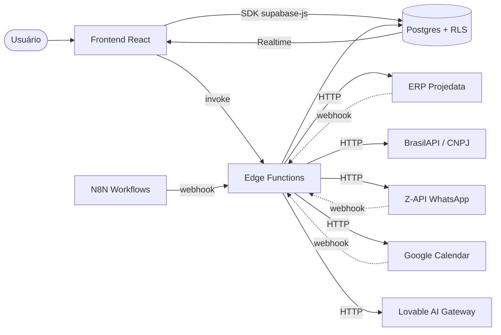

# Arquitetura do Sistema — CRM Qualyvac

**Owner:** @felipe  
**Última revisão:** 2026-04-21

CRM B2B multi-tenant com regras fiscais brasileiras, integração com ERP Projedata, automações via N8N e fluxos assistidos por IA.

---

## Stack

| Camada | Tecnologia |
|---|---|
| Frontend | React 18 + Vite 5 + TypeScript + TailwindCSS |
| UI | shadcn/ui + Radix |
| Estado servidor | TanStack Query |
| Backend gerenciado | Lovable Cloud (Supabase: Postgres + Auth + Storage + Edge Functions) |
| Edge Functions | Deno (TypeScript) |
| IA | Lovable AI Gateway (Gemini 2.5, GPT-5) |
| Mensageria | Z-API (WhatsApp) |
| Automações externas | N8N |

---

## Visão geral

---

## Componentes principais

### Frontend (`src/`)
- **Páginas** (`src/pages/`): Pipeline, Orders, Customers, Products, Proposals, WhatsApp, Reports, Settings.
- **Hooks de domínio** (`src/hooks/`): isolam lógica de negócio (`usePipelines`, `useOrders`, `useFiscalRules`, `usePriceAuthorization`, etc.).
- **Componentes de domínio** (`src/components/<domain>/`): Pipeline (Kanban + Filters), Orders (Dialog + Approval), Fiscal, Bot Builder.
- **UI primitives** (`src/components/ui/`): shadcn customizado com tokens semânticos.

### Backend
- **Postgres com RLS por composição lógica** (ver memória `operational-rls-logic-composition`):
  `acesso = isolamento_tenant AND legal_entity_visivel AND (owner OR admin OR delegado OR criador)`
- **Triggers de integridade**: `validate_pipeline_legal_entity_match`, `a_auto_erp_versao`, locks de itens de pedido, sync legacy de `pipeline_legal_entities`.
- **RPCs SECURITY DEFINER** para operações que precisam burlar RLS de forma controlada (ex: `save_pipeline_with_entities`, `resolve_user_for_sales_rep`, `next_erp_sequence`).
- **Edge Functions** (`supabase/functions/`): integrações externas, sync ERP, geração de PDFs, IA, webhooks.

---

## Multi-tenant + Multi-CNPJ

Dois conceitos distintos, frequentemente confundidos:

| Conceito | Tabela | O que isola |
|---|---|---|
| **Tenant** | coluna `tenant_id` (UUID, sem FK) | Cliente do SaaS. Hoje: 1 tenant ativo (Qualyvac). |
| **Legal Entity** | `legal_entities` + `user_legal_entities` | CNPJs emissores do grupo (Qualyvac, Embazec, Martina, Novafix). Define quem fatura. |

- Frontend filtra por `legal_entity_id` ativo (seletor no header).
- Pipelines podem ser globais (NULL) ou restritos via `pipeline_legal_entities` (N:N).
- Deals/Orders/Proposals carregam `legal_entity_id` próprio + validação por trigger.

---

## Onde vivem as regras de negócio

> **Princípio:** regra crítica que **não pode ser burlada** vai para o banco (RLS/trigger). Regra que orienta a UX vai para o frontend. Integrações ficam em edge functions.

| Tipo de regra | Local | Exemplo |
|---|---|---|
| Acesso a dado | RLS Postgres | "Vendedor só vê seus deals" |
| Integridade obrigatória | Trigger | `validate_pipeline_legal_entity_match` impede deal em pipeline de outro CNPJ |
| Cálculo determinístico fiscal | Função SQL / hook compartilhado | IPI conforme `contribuinte_ipi` |
| Validação preventiva pré-sync | Edge Function | `validate-order-sync` antes de enfileirar |
| UX / orientação ao usuário | Hook React | `usePriceAuthorization` mostra alerta de override |

---

## Integrações externas (resumo)

| Integração | Tipo | Função |
|---|---|---|
| **ERP Projedata** | REST + ASDCOMANDO/JSON | Sync bidirecional de clientes, produtos, pedidos. Loop control via `origem_alteracao`. |
| **BrasilAPI** | REST | Lookup de CNPJ (preenche cadastro automaticamente). |
| **Z-API** | REST + Webhook | WhatsApp inbound/outbound, QR code, bot flows. |
| **Google Calendar** | OAuth + Webhook | Sync de tarefas (`tasks` ↔ events). |
| **N8N** | Webhook → Edge Function | Automações disparadas por eventos do CRM. |
| **Lovable AI Gateway** | REST | Sugestões de NCM, análise de conversas, copywriting. |

Detalhes de cada integração em arquivos próprios (a criar conforme necessidade).

---

## Pontos de alto risco

Áreas do sistema onde erros têm impacto crítico e exigem atenção redobrada:

| Área | Risco | Mitigação |
|---|---|---|
| **Integração ERP** | Sincronização falha, duplicidade de pedidos, loops infinitos | `origem_alteracao`, idempotência via `pedido_terceiro`, validação prévia |
| **Triggers de banco** | Efeitos colaterais invisíveis, validações quebrando em produção | Testar com dados reais, revisar RLS, usar `supabase--linter` |
| **RLS (Row Level Security)** | Vazamento de dados entre CNPJs, usuários vendo o que não devem | Políticas compostas, testar com múltiplos perfis, `has_pipeline_access()` |
| **Multi-CNPJ** | Confusão entre `tenant_id` e `legal_entity_id`, pipelines restritos vs globais | Documentar escopo, usar RPC `save_pipeline_with_entities`, validar triggers |
| **Fiscal / IPI** | Cálculo incorreto de tributos, propostas com valores errados | Testar com `contribuinte_ipi` true/false, validar NCM, usar engine fiscal |
| **Janela de acesso por tenant** | Regra temporal aplicada em sessão + RLS RESTRICTIVE em `deals`/`orders`. Erro de configuração pode travar o tenant inteiro. | Admin/desenvolvedor são imunes; fail-safe quando não há regra; ver [ADR 0001](../02-decisions/0001-access-control-calendar.md) e [regra de negócio](../03-business-rules/access-calendar.md) |

> **Para novos desenvolvedores:** leia este documento e [`docs/00-overview/known-issues.md`](./known-issues.md) antes de tocar em qualquer uma dessas áreas.

---

## Convenções importantes

- **`sales_rep_id` é a fonte de verdade de ownership.** `owner_id` é fallback/auditoria. Ver memória `ownership-standardization-strategy`.
- **`origem_alteracao` (CRM/ERP/SYNC)** previne loops infinitos de sincronização bidirecional.
- **Snapshot + lock de itens de pedido** garante integridade histórica (preço/descrição congelados após status `nonpending`).
- **Sessão única por usuário** (licenciamento). Login novo invalida o anterior.

---

## Diagramas adicionais

À medida que fluxos críticos forem documentados (em `04-workflows/critical-flows/`), eles trazem seus próprios diagramas Mermaid (sequenceDiagram).

---

## Glossário rápido

| Termo | Significado |
|---|---|
| **Deal** | Negócio em pipeline comercial. |
| **Pipeline** | Funil. Pode ser comercial (`sales`), operacional, suporte ou híbrido. |
| **Stage** | Etapa do pipeline. Tem `stage_status` (open/won/lost), `stage_category`, `stage_phase`. |
| **Sales Rep** | Vendedor comercial (entidade própria, não usuário). 1 usuário pode gerenciar N sales reps. |
| **Legal Entity** | CNPJ emissor (Qualyvac, Embazec, etc.). |
| **Pedido `nonpending`** | Pedido fora do status "Pendente" — itens travados (lock). |
| **`origem_alteracao`** | Marca quem alterou o registro (CRM, ERP, SYNC) para evitar loops. |
| **`erp_versao`** | Versão estrutural do produto, gerada por trigger (formato `LxCxE`). |
