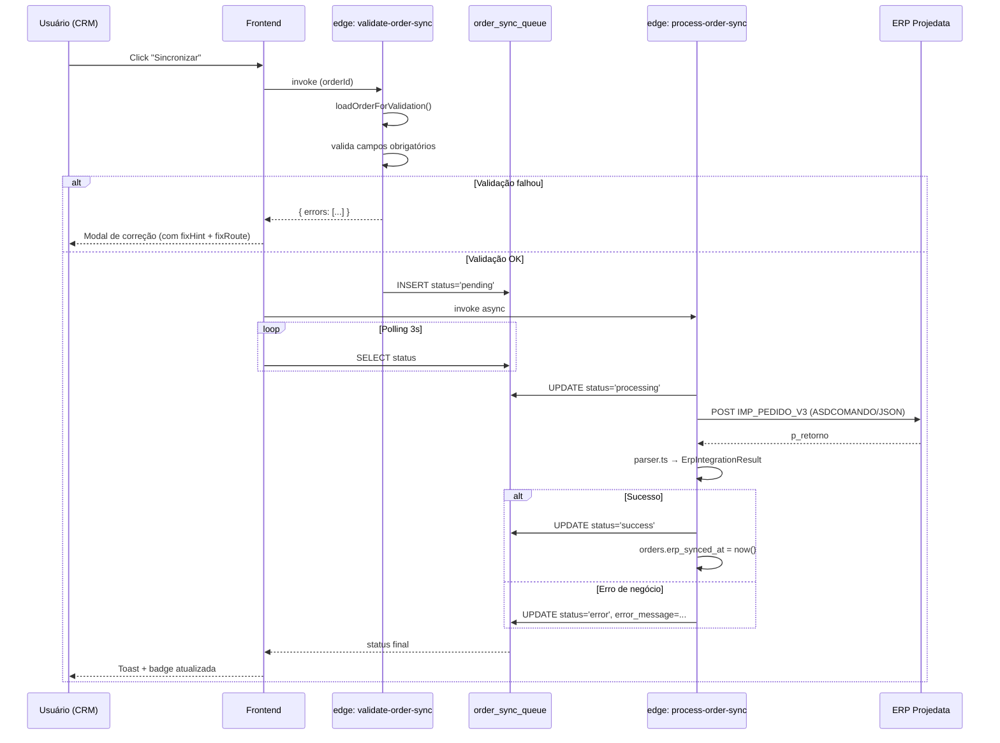

# Fluxo Crítico — Sincronização de Pedidos com ERP Projedata

**Owner:** @felipe  
**Última revisão:** 2026-04-21

**Status:** Ativo · **Severidade do fluxo:** 🔴 alta (impacta faturamento)

---

## 1. Objetivo

Enviar pedidos criados/editados no CRM para o ERP Projedata (`IMP_PEDIDO_V3`) de forma **idempotente**, **validada antes do envio**, e **sem loops infinitos** com o webhook de retorno.

---

## 2. Gatilho

Disparado **manualmente** pelo usuário em `OrderSyncButton`:
- Status pendente → botão "Sincronizar"
- Status `blocked_validation` → botão `Wrench` abre modal de correção sem reenviar
- Status sincronizado mas editado → botão "Reenviar" (pedido marcado "Desatualizado")

> **⚠️ REGRA CRÍTICA:** Não há sync automática por trigger. Sempre manual e auditada.
> 
> *Esta regra é aplicada via arquitetura de edge functions. Não pode ser burlada pelo frontend. Qualquer alteração exige revisão completa do fluxo.*

---

## 3. Diagrama do fluxo

---

## 4. Passos detalhados

### 4.1 Pré-validação (read-only)
- Edge function: `supabase/functions/validate-order-sync/index.ts`
- Usa loader compartilhado: `_shared/projedata/order-loader.ts → loadOrderForValidation()`
- Valida (entre outros): `pedido_terceiro` presente, criador com `erp_user_code`, vendedor com `erp_vendor_code`, cliente sincronizado, produtos com `erp_code`, `cd_empresa` mapeado para `legal_entity_id`, condição/forma de pagamento mapeadas.
- Retorna `errors[]` com `{ field, message, fixHint, fixRoute }` para o modal `SyncValidationModal`.

### 4.2 Enfileiramento
- INSERT em `order_sync_queue` com `status='pending'`, `next_retry_at=now()`.
- Em **reenvio manual**, `next_retry_at` é zerado para garantir disparo imediato (padrão "Fast Sync").

### 4.3 Processamento
- Edge function: `supabase/functions/process-order-sync/index.ts`
- Atualiza `status='processing'`, monta payload via mapper dinâmico (`_shared/projedata/order-mapper.ts`).
- Envia ao ERP no envelope ASDCOMANDO + JSON (ver memória `projedata-serialization`).
- Parseia retorno com `_shared/erp/projedata-parser.ts` → `ErpIntegrationResult` (DTO unificado).

### 4.4 Atualização de estado
- ✅ Sucesso: `orders.erp_synced_at = now()`, `orders.origem_alteracao = 'SYNC'`, queue `status='success'`.
- ❌ Erro de negócio: queue `status='error'` + mensagem do ERP. Não consome retry.
- ❌ Erro de validação tardia: queue `status='blocked_validation'`, `next_retry_at=null`. UI vira `Wrench`.

### 4.5 Status "Desatualizado"
Calculado no frontend: se `updated_at - erp_synced_at > 5 segundos`, badge fica amarela. Margem de 5s evita falso-positivo de timestamps de sync.

---

## 5. Pontos de falha conhecidos

| Sintoma | Causa provável | Solução |
|---|---|---|
| `blocked_validation` ao sincronizar | Cliente sem `erp_code`, vendedor sem `erp_vendor_code`, produto sem `erp_code` | Modal mostra `fixRoute` para tela correta |
| `cd_empresa` ausente | Pedido sem `legal_entity_id` ou mapeamento ERP faltando | Configurações → Mapeamentos ERP |
| Loop de sync (CRM ↔ ERP) | `origem_alteracao` não setado corretamente no webhook | Trigger ignora `origem_alteracao IN ('ERP', 'SYNC')` |
| Pedido marcado "Desatualizado" sem ter sido editado | Diferença <5s entre updated_at e erp_synced_at | Margem já tratada — investigar trigger que altera `updated_at` indevidamente |
| Erro `erp_user_code não configurado` | Usuário criador sem mapping em `profiles.erp_user_code` | Configurações → Usuários |
| `ORA-20270` em `TGI_FINVENCTOS` no `pagto[]` | Parcela com `tipo='P'` enviada com `fator=0` (ERP exige `0 < fator ≤ 100` para P) | Mapper omite `fator` quando `tipo='P'` — ERP rateia o saldo automaticamente. Ver seção 4.3.1 |

---

## 6. Idempotência e re-envio

- **Chave de idempotência no ERP:** `pedido_terceiro` (BIGINT, igual ao `order_number` do CRM).
- Re-enviar o mesmo pedido **atualiza** no ERP, não duplica.
- Re-envio é **permitido manualmente** mesmo após sucesso (para refletir alterações locais).

---

## 7. Onde inspecionar logs

| Camada | Onde |
|---|---|
| Edge function | Painel Lovable Cloud → Functions → `process-order-sync` / `validate-order-sync` → Logs |
| Queue | `SELECT * FROM order_sync_queue WHERE order_id = '...' ORDER BY created_at DESC` |
| Auditoria | `SELECT * FROM audit_logs WHERE entity_type='order' AND entity_id='...'` |
| Histórico ERP | `SELECT * FROM erp_sync_logs WHERE entity_id='...'` |
| Conflitos de import | `SELECT * FROM import_conflict_log` |

---

## 8. Tabelas e funções envolvidas

**Tabelas:**
- `orders`, `order_items`
- `order_sync_queue` (com `validation_errors JSONB`, `validation_fields TEXT[]`)
- `erp_sync_logs`
- `erp_mappings` (cd_empresa, payment, etc.)
- `profiles.erp_user_code`, `sales_reps.erp_vendor_code`

**Edge functions:**
- `validate-order-sync`
- `process-order-sync`

**Código compartilhado:**
- `_shared/projedata/order-loader.ts`
- `_shared/projedata/order-mapper.ts`
- `_shared/projedata/order-validator.ts`
- `_shared/erp/projedata-parser.ts`

**Componentes UI:**
- `src/components/orders/OrderSyncStatus.tsx`
- `src/components/sync/SyncValidationModal.tsx`

---

## 9. NÃO fazer

> **⚠️ REGRAS CRÍTICAS — aplicadas via trigger/RLS no banco. Não podem ser burladas pelo frontend. Qualquer alteração exige revisão completa do fluxo.**

- ❌ Disparar sync automática por trigger (decisão arquitetural — sempre manual).
- ❌ Atualizar `orders.erp_synced_at` fora da edge function.
- ❌ Bypass do `validate-order-sync` (todas as entradas devem passar pela validação).
- ❌ Setar `origem_alteracao = 'CRM'` ao processar webhook do ERP (causa loop).

---

## 10. Pós-mortems / aprendizados

Erros desse fluxo devem ser registrados em [`docs/00-overview/known-issues.md`](../../00-overview/known-issues.md) com formato KI-XXXX.
